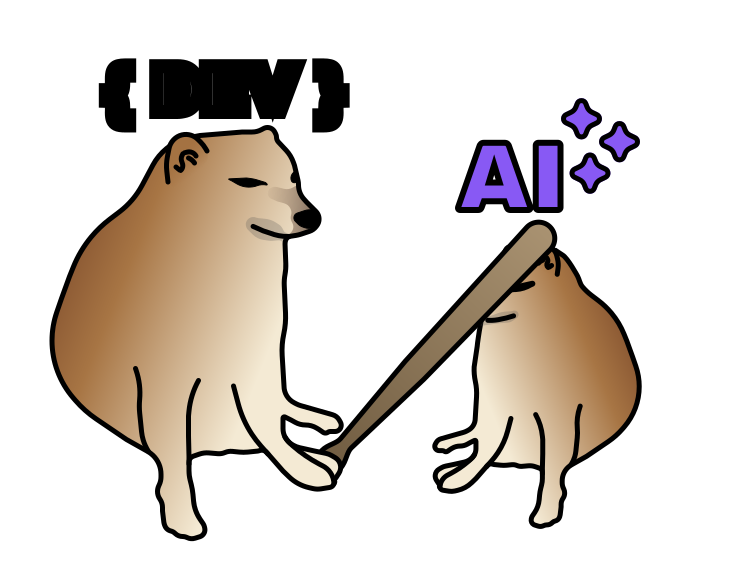

# AGENTS.md

[AGENTS.md](/AGENTS.md) template to guide AI agent behavior. Improve response structure, reduce input and output tokens, correct normie behavior (this includes vibe coders), improve DX, and provide necessary context for querying project information.

That said, this [AGENTS.md](/AGENTS.md) template is not intended for fully vibe-coded projects but for human-maintained projects that use AI agents as a complementary tool.

## The problems

- AI agents often produce verbose and unfocused responses.
- AI agents may use excessive MCP calls, leading to context overload and inefficiency.
- Gross misunderstandings of user intent and project context.
- They use emojis, ugh.
- They create unnecessary files (Claude, i'm looking at you) and modify important ones without permission.
- Often fall into a credit-burn loop when tests or builds fail _(run tests > fails > AI: Oh! I see, this is wrong let me fix that > run tests > fails > AI: This keeps failing, this is the real problem > run tests > fails > AI: Let's take a different approach > run tests > fails > AI: I will omit tests because is a false positive [lie] > app broken)_.
- They don't apply good criteria, if an user isn't right about something, they should be warned.
- Often waste tokens on boilerplate or unnecessary abstractions or //commenting code.

## The solution

- [Limit](/AGENTS.md#L51) the number of tasks to the minimum required to avoid context overload and excessive MCP calls.
- [Limit](/AGENTS.md#L93) the number of attempts to run tests/builds to avoid credit burn loops.
- List a [DO NOTs section](/AGENTS.md#do-not) defining forbidden behaviors (DO NOT modify README.md, DO NOT create .md files, DO NOT use emojis, DO NOT install packages, etc).
- Define a [approval workflow for tasks](/AGENTS.md#tasks). Instruct to present a clear and ordered list of tasks before execution with scope definition to ensure the user understands AND APPROVES the plan.
- Define general and code guidelines to ensure quality, consistency, and maintainability avoiding [over-engineering](/AGENTS.md#L31), anti-patterns, and bad practices.
- Using [Conventional Commits](/AGENTS.md#commit-guidelines) for commit messages to ensure clarity and consistency in version control history.
- Using [tabs for indentation](/AGENTS.md#general-guidelines) since is more compact and saves tokens, after all, you can configure your IDE to convert them to spaces on save if needed.

## REMEMBER

AI is a barely-working tool as how it is served from high techs. It requires good context, clear instructions, and proper guardrails to be effective. That's the purpose of this AGENTS.md template.

You may customize it to your needs, but remember that the more complex and vibe-coded your project is, the less effective this template will be. AI agents are not yet capable of fully understanding complex human contexts and intentions.

And also be sure to add an `ARCH.md` file to give context about your architecture, tech stack, and project conventions (and mention it in the AGENTS.md).

## License

MIT License - see the [LICENSE](LICENSE) file for details.
